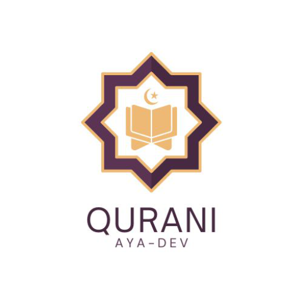

# 🕋 Quran Player App


<p align="center">

</p>

> A comprehensive digital platform for listening to the Holy Quran with all 114 surahs, complemented by a rich set of Islamic resources. Experience high-quality recitations, Islamic knowledge, prayer guidance, and more, all within an elegant and intuitive user interface.

## ✨ Key Features

-   📖 **Complete Quran with Arabic Text**: Access all 114 surahs with the original Arabic text, ensuring an authentic reading experience.
-   🎙️ **Multiple Renowned Reciters**: Choose from a selection of esteemed Quran reciters, including:
    -   Sheikh Mishary Rashid Alafasy
    -   Abdul Basit Abdul Samad
    -   Mahmoud Khalil Al-Husary
    -   And more, with the option to add more in future updates.
-   📅 **Integrated Hijri Calendar**: Seamlessly track Islamic dates and events with a built-in Hijri calendar.
-   💬 **Daily Hadiths**: Receive daily doses of wisdom and guidance with authentic hadiths, curated to enrich your knowledge and understanding of Islam.
-   📿 **Digital Tasbih Counter**: Keep track of your dhikr with a beautifully designed digital tasbih counter, enhancing your spiritual practice.
-   🤲 **Comprehensive Prayer Guide**: Learn and perfect your Wudu and Salah with detailed, step-by-step instructions and visual aids.
-   🌙 **Dark Mode Support**: Enjoy a comfortable reading and listening experience in low-light environments with full dark mode compatibility.
-   🤖 **AI-Powered Islamic Assistant**: Get instant answers to your questions about Islam and the Quran, powered by an intelligent AI assistant.
-   📱 **Fully Responsive Design**: Experience seamless functionality and optimal viewing across all devices, from desktops to tablets and smartphones.
-   ⚡ **Fast Performance**: Built with Next.js 14+ and optimized for performance, ensuring a smooth and responsive user experience.
-   🎨 **Modern UI with Tailwind CSS**: A clean and modern user interface, styled with Tailwind CSS for a consistent and visually appealing design.
-   🛠️ **TypeScript Integration**: Developed with TypeScript for enhanced code maintainability and scalability.

## 🚀 Installation

### Prerequisites

-   Node.js (version 18.0.0 or higher)
-   npm or yarn (package managers)

### Setup

1.  **Clone the Repository**:
    ```bash
    git clone https://github.com/11FaZe11/Qurani.git
    ```
2.  **Open the folder directory**:
    ```bash
    cd Qurani
    ```

3.  **Install Dependencies**:
    Using npm:
    ```bash
    npm install
    ```
    Or using yarn:
    ```bash
    yarn install
    ```

4.  **Run the Development Server**:
    Using npm:
    ```bash
    npm run dev
    ```
    Or using yarn:
    ```bash
    yarn dev
    ```
    Open your browser and navigate to `http://localhost:3000` to view the application.

5.  **Build for Production**:
    Using npm:
    ```bash
    npm run build
    npm run start
    ```
    Or using yarn:
    ```bash
    yarn build
    yarn start
    ```

## 🌐 Live Demo

Visit the website: [https://qurani-v3.vercel.app/](https://qurani-v3.vercel.app/)

## 📱 Android Download

Download the Android App: [https://www.webintoapp.com/store/663371](https://www.webintoapp.com/store/663371)
